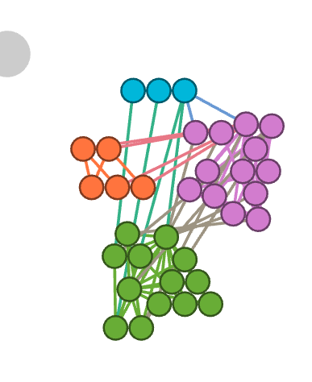
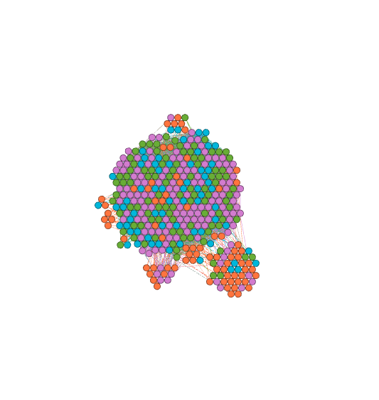
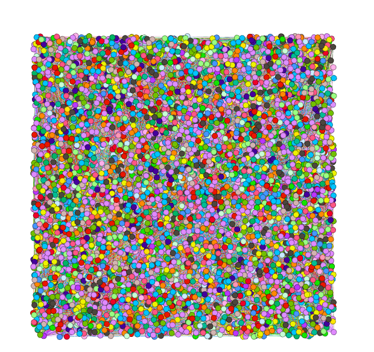
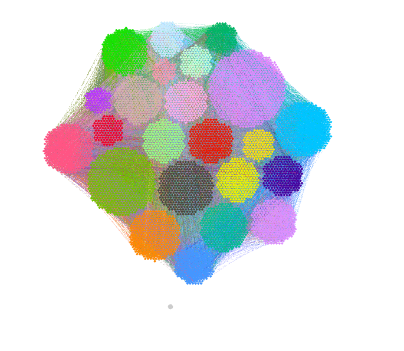
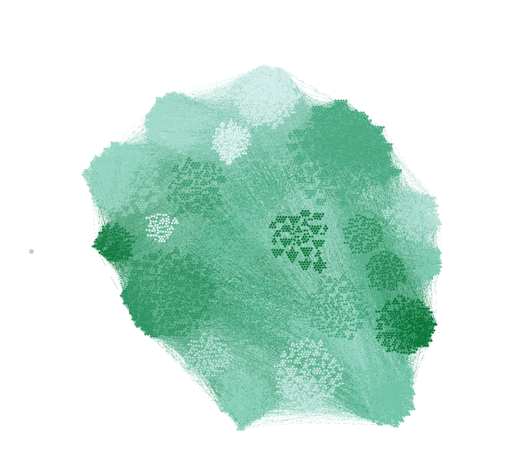
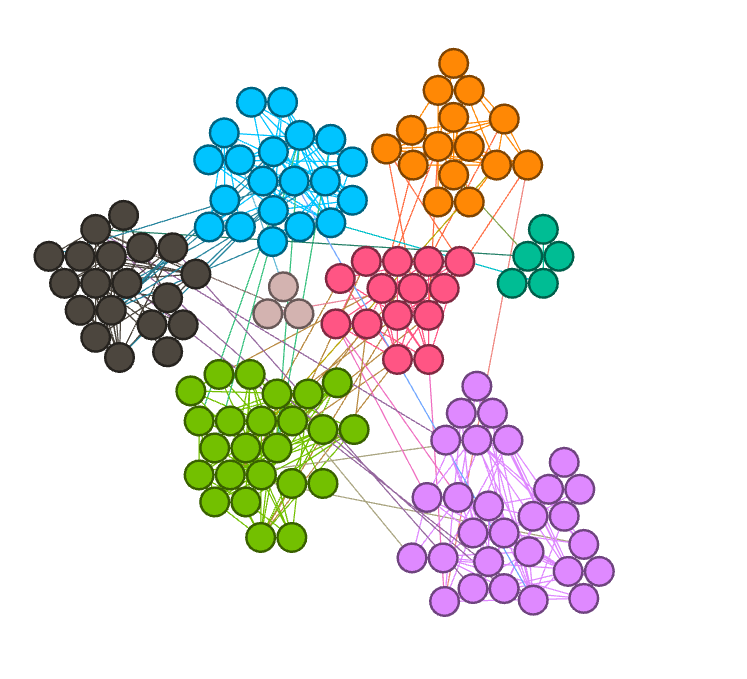
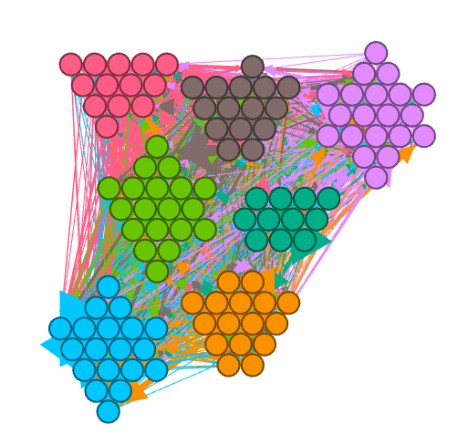
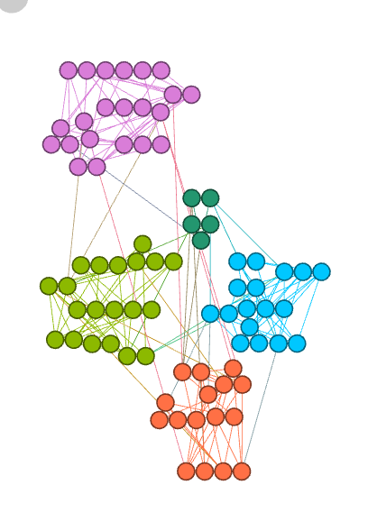
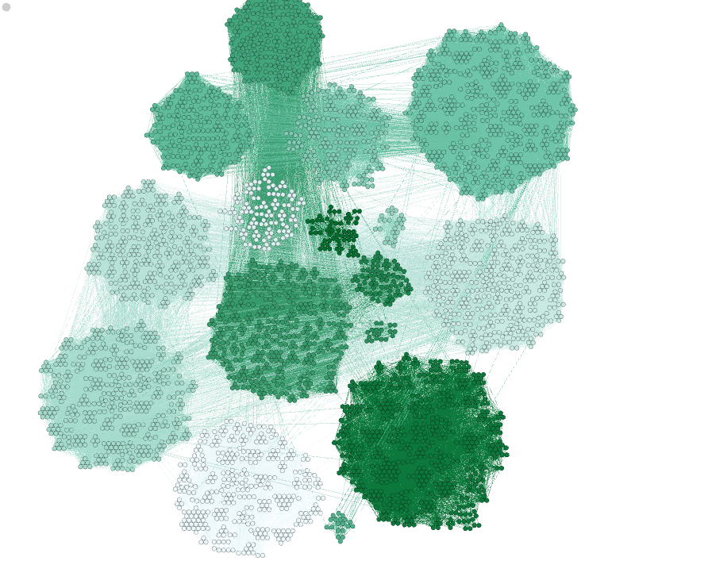
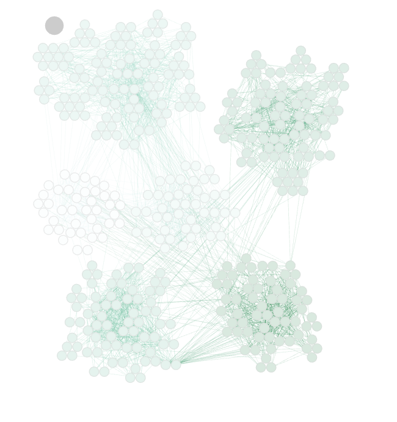

# HW 8 

Rebekah Daniels
CS575
Goodrich
3/3/2026

## Question 3: 

### Karate 

Modularity: 0.420
Modularity with resolution: 0.420
Number of Communities: 4

Average Clustering Coefficient: 0.588
Total triangles: 45

Density: 0.139

### Lanyland Peer Group

This graph is from a subset of Twitter users that follow Lanyland.
I think the clustering coeffiecient will be quite high. 
I also thing the modularity will be high. I think there could be several communities (maybe a dozen?) that emerge from the graph. 

Results:

Average Clustering Coefficient: 0.503
Total triangles: 180177
The Average Clustering Coefficient is the mean value of individual coefficients.

Results:

Modularity: 0.096
Modularity with resolution: 0.096
Number of Communities: 4

Results:

Density: 0.156

I was wrong on both accounts. There is very little modularity and the clustering coefficient was lower than I thought it would be. 

### Monday Classes

I think there will be more communities that emerge because people have classes together.

I think the clustering coefficient will quite higher because if I have a class with you and one other person, 
you and the other person also have that class together. 

The density is relatively low because most people won't have very many classes with other people compared with 
the whole campus. 

Average Clustering Coefficient: 0.564
Total triangles: 1416893
The Average Clustering Coefficient is the mean value of individual coefficients.

Results:

Modularity: 0.522
Modularity with resolution: 0.522
Number of Communities: 23

Results:

Density: 0.007

### High School friendships

Predictions: 
- Low density (most people won't know everyone -- max mental capacity)
- mid modularity (some clique friend grounds, and some friends with everyone)
- clustering coeffiecent higher (Your friends are often friends with each other)

Results:

Density: 0.049

Results:

Average Clustering Coefficient: 0.553
Total triangles: 450

Modularity: 0.707
Modularity with resolution: 0.707
Number of Communities: 8

I predicted mostly correctly. The modularity was higher than I expected with fewer communities than I expected. 

This is by far the most modular graph thus far. With very relatively few edges beteen the communities.  

### Hypertext Conference

Predictions: 
- low to mid density: It's hard to see everyone at a conference 
- low modularity: A conference setting isn't long enough to create cliques unless people attended together. 
- high number of communities: there may be a lot of relatively small communities for people that had similar interests
- clustering coefficient: low. It's unlikely that my two acquaintances would meet each other. 

Results:

Density: 0.171

Modularity: 0.232
Modularity with resolution: 0.232
Number of Communities: 7

Average Clustering Coefficient: 0.265

- I was mostly correct on density. It is much more dense than the high school friendship one
- I was correct on the low modularity but I was incorrect on the number of communities captured.
- I was correct on the clustering coefficient -- it is lower. It is a little higher than I thought it would be. 
There were more connections created at the conference than I thought -- especially compared to the high school frienship one. 

### Synthetic

Predictions:
- low density
- mid modularity and 4-5 communities based on the description
- low to mid clustering coefficient

Results:

Density: 0.061

Average Clustering Coefficient: 0.222

Modularity: 0.651
Modularity with resolution: 0.651
Number of Communities: 5

### Facebook Circles

Predictions:
- Mid to high clustering coefficient (a lot of your friends probably know my friends)
- Mid to high modularity (a lot of connections between people in a community, but people are probably part of multiple groups). A very high number of groups. 
- lower density (maybe around .25?)

Density: 0.011

Average Clustering Coefficient: 0.617
Total triangles: 1612010

Modularity: 0.835
Modularity with resolution: 0.835
Number of Communities: 16

Lower density than I expected.
Much higher modularity than I expected. 
Less communities than I expected. 

### Dublin Conference

Predictions:
- Many communities (5-8)
- Lower modularity 
- Lower density 

Modularity: 0.702
Modularity with resolution: 0.702
Number of Communities: 6

Density: 0.033

Average Clustering Coefficient: 0.467
Total triangles: 7114

Much higher modularity than I expected.
About the number of communities I expected based on the previous graph for a conference
Higher clustering coefficient which makes sense with the higher modularity too. 

