# Homework 3 Write Up

## Code 

### Wikipedia Version Add Edges

```py
import random
def add_edges_wikipedia_version(vertex_set: set[int], 
               new_vertex: int, 
               G: nx.Graph) -> set[tuple[int,int]]:
    new_edges: set[tuple[int,int]] = set()
    
    sum_k_j = G.number_of_edges() * 2 
    
    for vertex in vertex_set:
        p_i = G.degree[vertex]
        prob = p_i / sum_k_j
        if random.random() < prob:
            new_edges.add((new_vertex, vertex)) 

    return new_edges
```

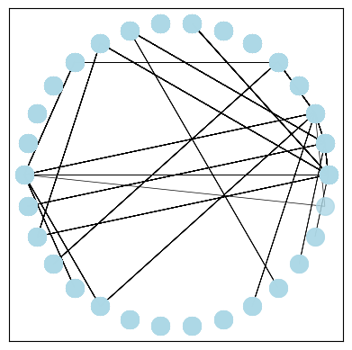

### Networkx Version Add Edges

```py
def add_edges_networkx_version(vertex_set: set[int], 
               new_vertex: int, 
               G: nx.Graph,
               required_edges: int = 1) -> set[tuple[int,int]]:
    new_edges: set[tuple[int,int]] = set()

    if required_edges < 1:
        raise ValueError("must have at least one required edge")

    sum_k_j = G.number_of_edges() * 2     

    def add_if_meets_prob(curr_vertex): 
        p_i = G.degree[curr_vertex]
        prob = p_i / sum_k_j
        if random.random() < prob:
            new_edges.add((new_vertex, curr_vertex)) 
    
    for vertex in vertex_set:
        add_if_meets_prob(vertex)

    while len(new_edges) < required_edges:
        random_vertex = random.choice(list(vertex_set))        
        add_if_meets_prob(random_vertex)
            
    return new_edges
```

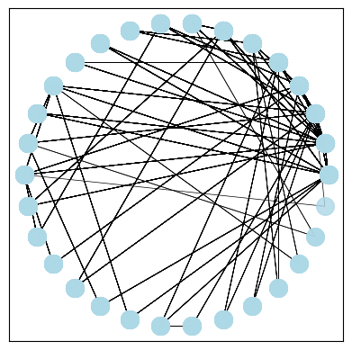{ width=1in }

## Discussion 

### Question/Instruction: 

Run the algorithm for various initial numbers of connected vertices (the m0) on the wikipedia page.

Choose some of the interesting results and plot the histogram of the degree distribution. 

Use the "log-log" plot technique discussed in class, and discuss whether the network is scale free. 

### Response:

#### Graph 1: 

I chose 60 with 2 edges each because I thought it would give me a better
representation than 30 and that is what is used in the example code. 
For the following graphs, I used the parameters 

Nodes=60; required_vertexes=2; initially connected nodes=2

I believe This is a scale free graph because for the relatively straight line in the log log graph. 

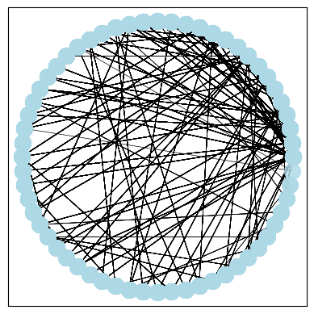

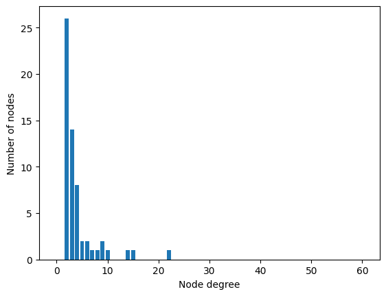

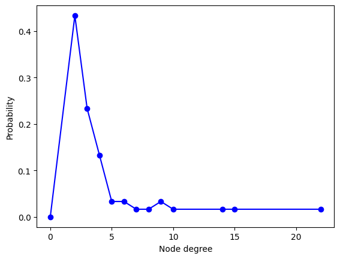

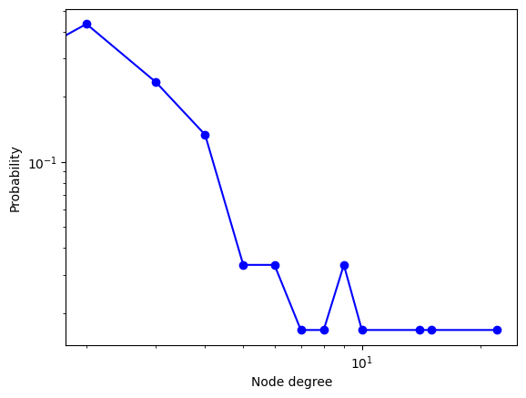


#### Graph 2

I used the same graph as above (Nodes: 60; required vertexes = 2) but initialy 5 vertexes were fully connected.

Note there are clusters around the first 5 nodes in the right corner on the visualized graph.

Most plots look very similar to the graph above. The log-log graph looks similar as well. 


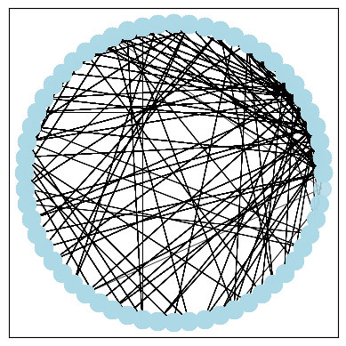

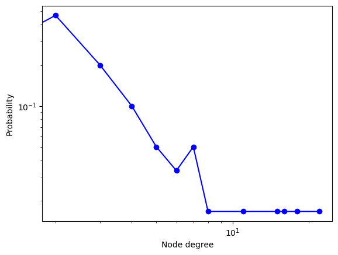

#### Graph 3

I used the same graph as above (Nodes: 60; required vertexes = 2), but included additional 5 initial vertices, each with a single edge to vertex zero. 

Note the starting vertex has even more edges than prior

Drops faster and doesn't follow as scale as closely but still doesn't follow the trenc as closely and looks less scale free than the other previous graphs. 

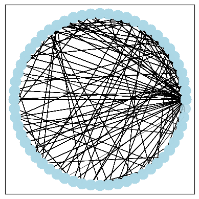

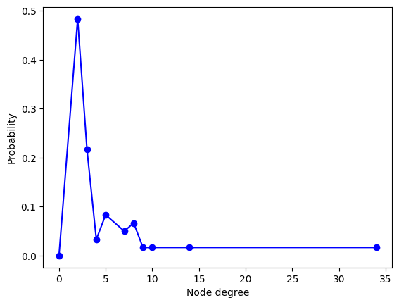


#### Graph 4

Nodes: 60; required vertexes = 2; initially connected (10)

This is just the log log plot and it appears to be scale free but it has a steeper slope than the graphs without initial connected nodes. 

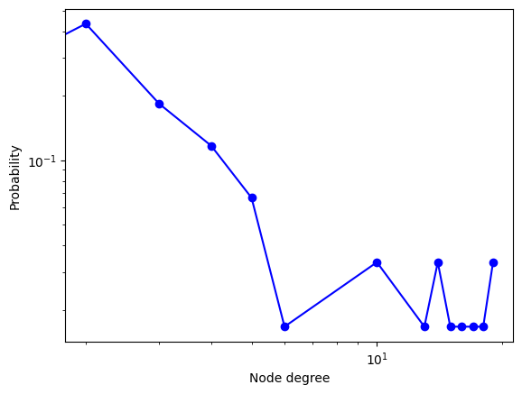


#### Graph 5

Nodes: 60; required vertexes = 2; initially connected (20)

This one is interesting (It looks kind of cool (: )): 

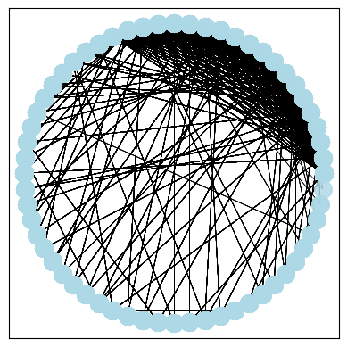

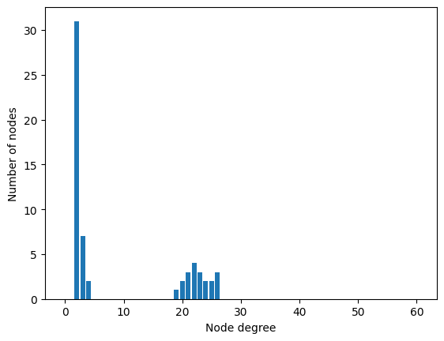

Note two clumps -- ones that started with at least 19 verticies (from the 20) and then the ones that didn't. 

This skews the degree density plot

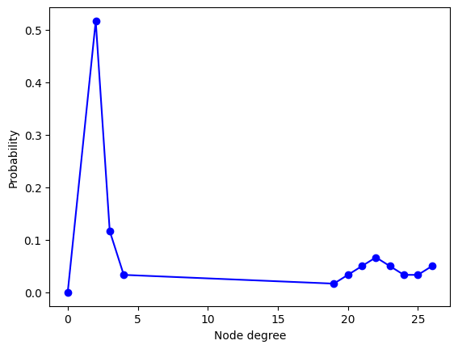

It doesn't appear to be scale free overall because of the two significant clumps. Perhaps if we were to just plot the nodes on the right hand clump (for degree distribution) then it might appear to be scale free. 

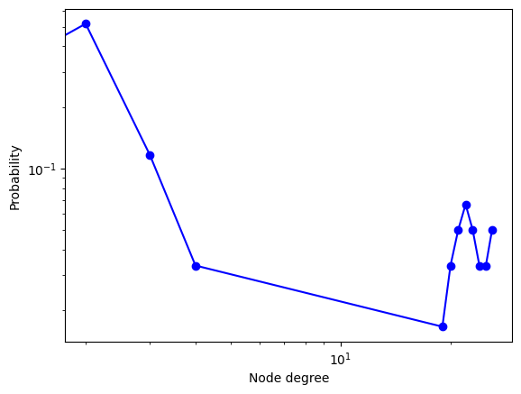

#### Graph 6

Nodes: 60; required vertexes = 2; initially fully connected (40)

This one is interesting: 

This shows a similar result but is accentuated by the fact that 2/3 of the vertices coming in are already connected. Making it very difficult for any of the new vertices to gain any more than just the required vertices. 

This graph does not appear to be scale free because there are two major clusters and neither appear to follow a distribution. 

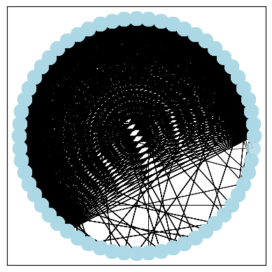

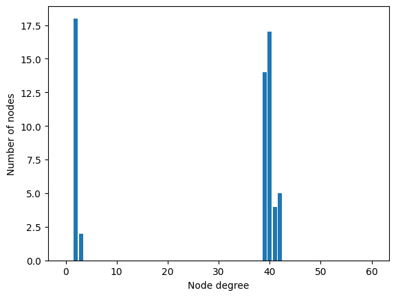

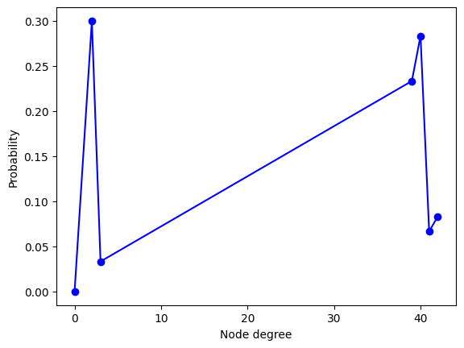


### Question: 

Describe what you observed from the animations and relate it to the phrase "the rich get richer". 

### Response: 

For the wikipedia implementation of adding edges, it is impossible for the nodes with no connections to gain more connections.
Those who are "poorest" cannot move out of the poorest category because they have no connections and have a 0 percent probability 
of being chosen again. 

Every time a node is selected to add an edge to, it makes it more likely that an edge will be added to that node in the future.
It is more likely for those with existing connections (especially the initial starting ones) to gain more vertices
based soley on probability. 

The "rich" nodes get "richer" because more nodes are added and everytime there is a node added, it becomes more likely in the future 
that an edge will be added. 

### Question: 

Discuss what this means for why some networks evolve to display the scale-free property.

### Response: 

This means that networks that have nodes with more edges, those nodes are more likely to gain more edges.
For example, on the internet, people are more likely to find and link existing websites that already have a number of links.
This can also be said of social media. If a influencer has a lot of followers, it is easier for them to attract more followers.
But, if someone has no followers on social media it is almost impossible for others to find them and for them to gain more followers. 
Often, naturally, edges tend to cluster around the nodes that already have edges. 