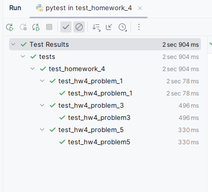

You will be working with the files in the tests/test_homework_4 directory. 

1.
For a population of at least 1000 agents and only one agent initially infectious, select values for m, p, and γ
 so that at the peak of the epidemic more than 80% of the population is infectious.  Give the values of m, p, and  γ
 in the box below. You will know that your code is successful when it passes the test_hw4_problem_1 test in the file test_hw4_problem_1.py. 

m = 1       # Probability of meeting
p = 0.4     # Transmission rate
gamma = 0.01 # Recovery rate
N = 1000
s0 = N-1
i0 = 1
r0 = 0
dt = 0.1

2.
Describe why you chose the parameters you used in problem 1 and how you came to choose those parameters.
 
The only parameter I modified from the defaults was making the gamma really really small. When people take a long time to recover, then more people are infected at one time. 

3.
For a population of at least 1000 agents and at least 20% of the agents initially infectious, select values for m, p, and γ
 so that at the end of the epidemic between 40% and 50% of the population was never infected.  Give the values of m, p, and  γ
 in the box below. You will know that your code is successful when it passes the test_hw4_problem_3 test in the file test_hw4_problem_3.py. 
 
m = 1       # Probability of meeting
p = 0.13     # Transmission rate
gamma = 0.1 # Recovery rate
N = 1000
s0 = N-1
i0 = N * .2
r0 = 0
dt = 0.1
duration = 140

4.
Describe why you chose the parameters you used in problem 3 and how you came to choose those parameters.
 
I only modified p, or the probability of transmission. I did a binary search-type strategy. I lowered p significantly 
and less than 40% of the population was never infected. I raised p, and then repeated the process until I found a number 
that was within the range I was seeking. 

5.
For a population of at least 1000 agents and only one agent initially infectious, select values for m, p, and γ
 so that at least 40% of the population is never infections, at least 40% of the population has recovered, and no more than 10% of the population is infections at any one time. Set the simulation duration to 300.  Give the values of m, p, and  γ
 in the box below. You will know that your code is successful when it passes the test_hw4_problem_5 test in the file test_hw4_problem_5.py. 
 

m = 1       # Probability of meeting
p = 0.2     # Transmission rate
gamma = 0.14 # Recovery rate

6.
Describe why you chose the parameters you used in problem 5 and how you came to choose those parameters.
 
I reduced the transmission rate significantly. I did this because we don't want very many
people infectious at the same time. By reducing both the transmission rate (it takes longer for it to spread) less people have it at once. Additionally, increasing the recovery rate (it doesn't take as long to spread and people don't have it as long) means less people have it at once,
but it can still spread through the population to achieve the 40% susceptible and 40% recovered. 
I tried a few different numbers for gamma until I was able to pass the tests. 

7.
Upload a screenshot showing that your code passed all three test conditions. 
 

Or use a file:

 
 